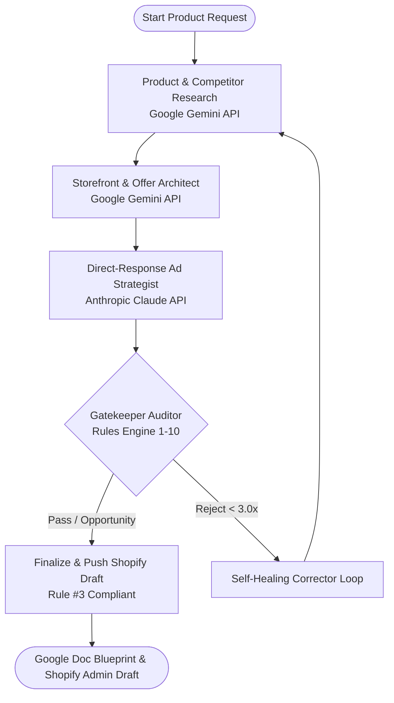

# 🐾 PawPawDoo — Multi-Agent DTC Dropshipping Orchestration

[](https://github.com/langchain-ai/langgraph)
[](https://www.python.org/)
[](https://shopify.dev/docs/api/admin-rest)
[](https://pawpawdoo.store)

> **"Pawmily first."** — Autonomous AI agent team engineered to research viral pet products, vet suppliers, architect high-converting DTC storefronts, generate direct-response ad creative, enforce strict financial margins, and publish draft deliverables directly to Shopify.

---

## 🏗️ Multi-Agent Architecture



---

## 🛡️ Core Rules & Guardrails Engine (`AGENT_INSTRUCTIONS.md`)

The system features an evolving, self-correcting rules engine with 10 learned rules:
1. **`[BRAND]`**: Brand Palette: Primary Terracotta (`#C86432`), Espresso (`#37281D`), Cream (`#FAF8F5`).
2. **`[BRAND]`**: Official Tagline: **"Pawmily first."** in all hero copy.
3. **`[PROCESS]`**: Strict **DRAFT Mode** — Never publish live changes or spend live budget without explicit human confirmation.
4. **`[CRO]`**: Mobile-first single-column layout with 48px tap targets and sticky CTA bar.
5. **`[FINANCE]`**: Minimum **3.0x landed markup multiplier** for ad CAC safety.
6. **`[PRICING]`**: Price lower than top Amazon Buy Box and eBay US listings while keeping $\ge 3.0\times$ markup.
7. **`[SUPPLIER]`**: Supplier vetting: $\ge 1$ year on AliExpress, $\ge 4.0\bigstar$ rating.
8. **`[LOGISTICS]`**: Default to US Warehouse (3–5 day delivery) if shipping cost difference is $\le \$3.00$.
9. **`[DATA]`**: Map AliExpress Product ID and DSers SKU for 1-click auto-fulfillment.
10. **`[OPPORTUNITY]`**: If a viral product fails 3.0x markup, flag as `[HIGH_POTENTIAL_UNDERCUT_OPPORTUNITY]` and generate an undercut pricing + multi-pack bundle recovery strategy.

---

## ⚡ Quick Start

### 1. Clone & Install Dependencies
```bash
git clone https://github.com/<your-username>/pawpawdoo-antigravity.git
cd pawpawdoo-antigravity

python -m venv .venv
# On Windows:
.venv\Scripts\activate
# On macOS/Linux:
source .venv/bin/activate

pip install -r requirements.txt
```

### 2. Configure Environment Variables
Copy `.env.example` to `.env` and fill in your keys:
```bash
cp .env.example .env
```

```env
GEMINI_API_KEY=your_gemini_key
ANTHROPIC_API_KEY=your_anthropic_key
SHOPIFY_STORE_URL=pawpawdoo.store
SHOPIFY_CLIENT_ID=your_client_id
SHOPIFY_CLIENT_SECRET=your_client_secret
SHOPIFY_ADMIN_ACCESS_TOKEN=your_admin_token
PAWPAWDOO_ENV=DRAFT
```

### 3. Run the Multi-Agent Pipeline
```bash
python run_team.py
```

### 4. Preview the Storefront Locally
```bash
python -m http.server 3000 --directory storefront
# Open http://localhost:3000 in your browser
```

---

## ☁️ Cloud Deployment & CI/CD

### Option A: GitHub Actions (Scheduled / On-Demand)
The included workflow [`.github/workflows/multi_agent_orchestration.yml`](.github/workflows/multi_agent_orchestration.yml) allows you to run product research runs on a daily schedule or trigger manually via GitHub Actions.
1. Add your repository secrets in **Settings > Secrets and variables > Actions**:
   - `GEMINI_API_KEY`
   - `ANTHROPIC_API_KEY`
   - `SHOPIFY_STORE_URL`
   - `SHOPIFY_CLIENT_ID`
   - `SHOPIFY_CLIENT_SECRET`
   - `SHOPIFY_ADMIN_ACCESS_TOKEN`
2. Run the workflow from the **Actions** tab.

### Option B: Docker / Container Cloud (Google Cloud Run / AWS / Railway)
```bash
docker build -t pawpawdoo-orchestration .
docker run --env-file .env -p 3000:3000 pawpawdoo-orchestration
```

---

## 📂 Repository Structure

```
.
├── .github/workflows/           # CI/CD Cloud Orchestration workflows
├── adapters/
│   ├── marketplace_adapter.py   # Amazon & eBay US benchmark scraper & pricer
│   ├── shopify_adapter.py       # Shopify Admin API client with auto-token renewal
│   ├── supplier_logistics_adapter.py # Supplier vetting & US warehouse selector
│   └── trends_adapter.py        # Google Trends, TikTok, and Meta Ad Library
├── agents/
│   ├── ad_strategist.py         # Claude direct-response video ad angles
│   ├── base.py                  # LLM unified layer with active rule injection
│   ├── gatekeeper_auditor.py    # 10-rule compliance & opportunity auditor
│   ├── product_research.py      # Gemini competitor & logistics research
│   └── storefront_architect.py  # Gemini DTC offer stack & mobile CRO builder
├── storefront/
│   ├── index.html               # Responsive high-converting DTC landing page
│   ├── styles.css               # Modern CSS with brand palette & glassmorphism
│   ├── app.js                   # Interactive bundle selector & countdown timer
│   └── shopify_theme_sections/  # Drop-in Shopify OS 2.0 Liquid sections
├── config.py                    # Brand constants & environment loader
├── graph.py                     # LangGraph state machine & self-healing router
├── rules_engine.py              # Dynamic AGENT_INSTRUCTIONS.md parser
├── run_team.py                  # CLI command center with rich formatting
├── AGENT_INSTRUCTIONS.md        # Self-correcting learned rules memory
├── output_google_doc_blueprint.md # Exported product launch blueprint
└── output_website_revamp_blueprint.md # Exported website design blueprint
```

---

## 📄 License
Proprietary & Confidential — **PawPawDoo LLC**.

